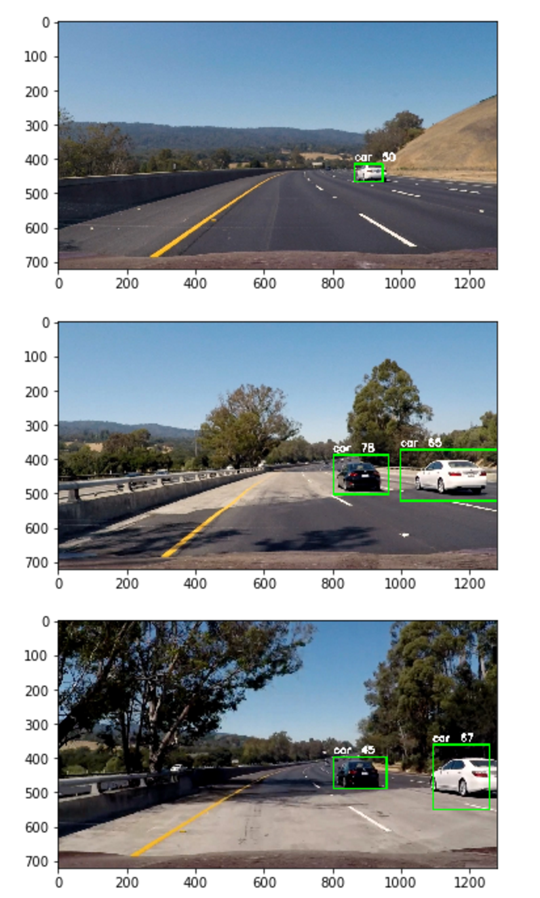

# Vehicle Detection Project

This is a project for Udacity self-driving car Nanodegree program. The aim of this project is to detect the vehicles in a dash camera video. The implementation of the project is in the file vehicle_detection.ipynb. This implementation is able to achieve 67FPS. 

# The final video output is 

## Introduction to object detection

Detecting vehicles in a video stream is an object detection problem. An object detection problem can be approached as either a classification problem or a regression problem. As a classification problem, the image are divided into small patches, each of which will be run through a classifier to determine whether there are objects in the patch. Then the bounding boxes will be assigned to locate around patches that are classified with high probability of present of an object. In the regression approach, the whole image will be run through a convolutional neural network to directly generate one or more bounding boxes for objects in the images.

In this project, we will use YOLO v2. This network is the state of the art for this task

## The YOLO v2

### Architecture of the convolutional neural network

There are a total of  50,676,061 parameters in the model and the detail of the architecture is in list in this table

____________________________________________________________________________________________________
Layer (type)                     Output Shape          Param #     Connected to                     
====================================================================================================
input_1 (InputLayer)             (None, 416, 416, 3)   0                                            
____________________________________________________________________________________________________
conv2d_1 (Conv2D)                (None, 416, 416, 32)  864                                          
____________________________________________________________________________________________________
batch_normalization_1 (BatchNorm (None, 416, 416, 32)  128                                          
____________________________________________________________________________________________________
leaky_re_lu_1 (LeakyReLU)        (None, 416, 416, 32)  0                                            
____________________________________________________________________________________________________
max_pooling2d_1 (MaxPooling2D)   (None, 208, 208, 32)  0                                            
____________________________________________________________________________________________________
conv2d_2 (Conv2D)                (None, 208, 208, 64)  18432                                        
____________________________________________________________________________________________________
batch_normalization_2 (BatchNorm (None, 208, 208, 64)  256                                          
____________________________________________________________________________________________________
leaky_re_lu_2 (LeakyReLU)        (None, 208, 208, 64)  0                                            
____________________________________________________________________________________________________
max_pooling2d_2 (MaxPooling2D)   (None, 104, 104, 64)  0                                            
____________________________________________________________________________________________________
conv2d_3 (Conv2D)                (None, 104, 104, 128) 73728                                        
____________________________________________________________________________________________________
batch_normalization_3 (BatchNorm (None, 104, 104, 128) 512                                          
____________________________________________________________________________________________________
leaky_re_lu_3 (LeakyReLU)        (None, 104, 104, 128) 0                                            
____________________________________________________________________________________________________
conv2d_4 (Conv2D)                (None, 104, 104, 64)  8192                                         
____________________________________________________________________________________________________
batch_normalization_4 (BatchNorm (None, 104, 104, 64)  256                                          
____________________________________________________________________________________________________
leaky_re_lu_4 (LeakyReLU)        (None, 104, 104, 64)  0                                            
____________________________________________________________________________________________________
conv2d_5 (Conv2D)                (None, 104, 104, 128) 73728                                        
____________________________________________________________________________________________________
batch_normalization_5 (BatchNorm (None, 104, 104, 128) 512                                          
____________________________________________________________________________________________________
leaky_re_lu_5 (LeakyReLU)        (None, 104, 104, 128) 0                                            
____________________________________________________________________________________________________
max_pooling2d_3 (MaxPooling2D)   (None, 52, 52, 128)   0                                            
____________________________________________________________________________________________________
conv2d_6 (Conv2D)                (None, 52, 52, 256)   294912                                       
____________________________________________________________________________________________________
batch_normalization_6 (BatchNorm (None, 52, 52, 256)   1024                                         
____________________________________________________________________________________________________
leaky_re_lu_6 (LeakyReLU)        (None, 52, 52, 256)   0                                            
____________________________________________________________________________________________________
conv2d_7 (Conv2D)                (None, 52, 52, 128)   32768                                        
____________________________________________________________________________________________________
batch_normalization_7 (BatchNorm (None, 52, 52, 128)   512                                          
____________________________________________________________________________________________________
leaky_re_lu_7 (LeakyReLU)        (None, 52, 52, 128)   0                                            
____________________________________________________________________________________________________
conv2d_8 (Conv2D)                (None, 52, 52, 256)   294912                                       
____________________________________________________________________________________________________
batch_normalization_8 (BatchNorm (None, 52, 52, 256)   1024                                         
____________________________________________________________________________________________________
leaky_re_lu_8 (LeakyReLU)        (None, 52, 52, 256)   0                                            
____________________________________________________________________________________________________
max_pooling2d_4 (MaxPooling2D)   (None, 26, 26, 256)   0                                            
____________________________________________________________________________________________________
conv2d_9 (Conv2D)                (None, 26, 26, 512)   1179648                                      
____________________________________________________________________________________________________
batch_normalization_9 (BatchNorm (None, 26, 26, 512)   2048                                         
____________________________________________________________________________________________________
leaky_re_lu_9 (LeakyReLU)        (None, 26, 26, 512)   0                                            
____________________________________________________________________________________________________
conv2d_10 (Conv2D)               (None, 26, 26, 256)   131072                                       
____________________________________________________________________________________________________
batch_normalization_10 (BatchNor (None, 26, 26, 256)   1024                                         
____________________________________________________________________________________________________
leaky_re_lu_10 (LeakyReLU)       (None, 26, 26, 256)   0                                            
____________________________________________________________________________________________________
conv2d_11 (Conv2D)               (None, 26, 26, 512)   1179648                                      
____________________________________________________________________________________________________
batch_normalization_11 (BatchNor (None, 26, 26, 512)   2048                                         
____________________________________________________________________________________________________
leaky_re_lu_11 (LeakyReLU)       (None, 26, 26, 512)   0                                            
____________________________________________________________________________________________________
conv2d_12 (Conv2D)               (None, 26, 26, 256)   131072                                       
____________________________________________________________________________________________________
batch_normalization_12 (BatchNor (None, 26, 26, 256)   1024                                         
____________________________________________________________________________________________________
leaky_re_lu_12 (LeakyReLU)       (None, 26, 26, 256)   0                                            
____________________________________________________________________________________________________
conv2d_13 (Conv2D)               (None, 26, 26, 512)   1179648                                      
____________________________________________________________________________________________________
batch_normalization_13 (BatchNor (None, 26, 26, 512)   2048                                         
____________________________________________________________________________________________________
leaky_re_lu_13 (LeakyReLU)       (None, 26, 26, 512)   0                                            
____________________________________________________________________________________________________
max_pooling2d_5 (MaxPooling2D)   (None, 13, 13, 512)   0                                            
____________________________________________________________________________________________________
conv2d_14 (Conv2D)               (None, 13, 13, 1024)  4718592                                      
____________________________________________________________________________________________________
batch_normalization_14 (BatchNor (None, 13, 13, 1024)  4096                                         
____________________________________________________________________________________________________
leaky_re_lu_14 (LeakyReLU)       (None, 13, 13, 1024)  0                                            
____________________________________________________________________________________________________
conv2d_15 (Conv2D)               (None, 13, 13, 512)   524288                                       
____________________________________________________________________________________________________
batch_normalization_15 (BatchNor (None, 13, 13, 512)   2048                                         
____________________________________________________________________________________________________
leaky_re_lu_15 (LeakyReLU)       (None, 13, 13, 512)   0                                            
____________________________________________________________________________________________________
conv2d_16 (Conv2D)               (None, 13, 13, 1024)  4718592                                      
____________________________________________________________________________________________________
batch_normalization_16 (BatchNor (None, 13, 13, 1024)  4096                                         
____________________________________________________________________________________________________
leaky_re_lu_16 (LeakyReLU)       (None, 13, 13, 1024)  0                                            
____________________________________________________________________________________________________
conv2d_17 (Conv2D)               (None, 13, 13, 512)   524288                                       
____________________________________________________________________________________________________
batch_normalization_17 (BatchNor (None, 13, 13, 512)   2048                                         
____________________________________________________________________________________________________
leaky_re_lu_17 (LeakyReLU)       (None, 13, 13, 512)   0                                            
____________________________________________________________________________________________________
conv2d_18 (Conv2D)               (None, 13, 13, 1024)  4718592                                      
____________________________________________________________________________________________________
batch_normalization_18 (BatchNor (None, 13, 13, 1024)  4096                                         
____________________________________________________________________________________________________
leaky_re_lu_18 (LeakyReLU)       (None, 13, 13, 1024)  0                                            
____________________________________________________________________________________________________
conv2d_19 (Conv2D)               (None, 13, 13, 1024)  9437184                                      
____________________________________________________________________________________________________
batch_normalization_19 (BatchNor (None, 13, 13, 1024)  4096                                         
____________________________________________________________________________________________________
conv2d_21 (Conv2D)               (None, 26, 26, 64)    32768                                        
____________________________________________________________________________________________________
leaky_re_lu_19 (LeakyReLU)       (None, 13, 13, 1024)  0                                            
____________________________________________________________________________________________________
batch_normalization_21 (BatchNor (None, 26, 26, 64)    256                                          
____________________________________________________________________________________________________
conv2d_20 (Conv2D)               (None, 13, 13, 1024)  9437184                                      
____________________________________________________________________________________________________
leaky_re_lu_21 (LeakyReLU)       (None, 26, 26, 64)    0                                            
____________________________________________________________________________________________________
batch_normalization_20 (BatchNor (None, 13, 13, 1024)  4096                                         
____________________________________________________________________________________________________
space_to_depth (Lambda)          (None, 13, 13, 256)   0                                            
____________________________________________________________________________________________________
leaky_re_lu_20 (LeakyReLU)       (None, 13, 13, 1024)  0                                            
____________________________________________________________________________________________________
concatenate_1 (Concatenate)      (None, 13, 13, 1280)  0                                            
____________________________________________________________________________________________________
conv2d_22 (Conv2D)               (None, 13, 13, 1024)  11796480                                     
____________________________________________________________________________________________________
batch_normalization_22 (BatchNor (None, 13, 13, 1024)  4096                                         
____________________________________________________________________________________________________
leaky_re_lu_22 (LeakyReLU)       (None, 13, 13, 1024)  0                                            
____________________________________________________________________________________________________
conv2d_23 (Conv2D)               (None, 13, 13, 125)   128125                                       
____________________________________________________________________________________________________
Total params: 50,676,061.0
Trainable params: 50,655,389.0
Non-trainable params: 20,672.0
____________________________________________________________________________________________________

In this project, we will use Keras to construct the YOLO model.

### Use pretrained weights

Training the YOLO network is time consuming. We will download the pretrained weights from [here](https://drive.google.com/file/d/0B6Yqn1bYWoPmV1A0UlNfU3JxTVU/view?usp=sharing) (190M) and load them into our Keras model. I used the weights that were learned on the PASCAL data set

Note that tensorflow is used for the backend in this project.

## Results

The following shows the results for several test images with a threshold of 0.3. We can see that the cars are detected:

## Discussion

This model is not bad. But there are false predictions and it is not very accurate. To improve it, I plan to teach on  VOC + PASCAL dataset, as well as on the data made specifically for self driving car.
But the main thing is that the model works in real time
## Reference

1. J. Redmon, S. Divvala, R. Girshick, and A. Farhadi, You Only Look Once: Unified, Real-Time Object Detection, arXiv:1506.02640 (2015).
2. J. Redmon and A. Farhadi, YOLO9000: Better, Faster, Stronger, arXiv:1612.08242 (2016).
3. Yolo v1, https://github.com/xslittlegrass/CarND-Vehicle-Detection
4. YAD2K, https://github.com/allanzelener/YAD2K

